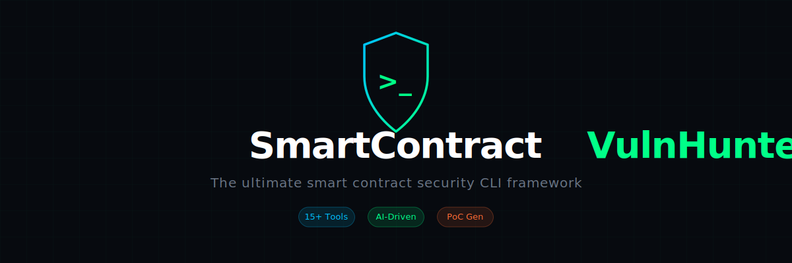

<div align="center">
  
  <h1>🛡️ SmartContract VulnHunter</h1>
  <p><strong>The ultimate smart contract security CLI framework for solo bug bounty researchers</strong></p>

  <p>
    
    
    
    
    <a href="https://vulnhunter.sh/docs"></a>
  </p>
</div>

---

## 📖 Overview

**SmartContract VulnHunter** orchestrates 15+ industry-leading security scanners, feeds the results to a Large Language Model (LLM) for deep analysis, generates Proof-of-Concept (PoC) exploits, and automatically produces submission-ready reports formatted specifically for major bug bounty platforms.

## 🌐 Supported Languages & Chains

| Language | Scanners Included | Tool Details |
| --- | --- | --- |
| **Solidity** | 10 | Slither, Aderyn, Solhint, Semgrep, 4naly3er, Mythril, Echidna, Medusa, Foundry, Heimdall |
| **Rust / Solana** | 3 | Trident, sec3 X-ray, cargo-audit |
| **Vyper** | 1 | Vyper (Slither-backed) |
| **Cairo** | 1 | Caracal |

> **Total Arsenal:** 15 robust adapters ready out-of-the-box.

---

## ✨ Core Features

### 🔍 Scanner Orchestration
- **Async Execution:** Ultra-fast, semaphore-based concurrency wrapper limits performance bottlenecks.
- **Auto-Detection:** Detects toolsets dynamically based on availability.
- **Data Normalization:** Converts and normalizes all scanner outputs into valid SARIF format.
- **Smart Deduplication:** Fingerprint-based duplicate removal to eliminate noise.

### 🧠 LLM Deep Analysis Pipeline
- **Kimi K2.5 Integration:** Operates with OpenAI-compatible APIs dynamically.
- **6-Pass Auditor Pipeline:**
  1. ***Protocol Understanding***
  2. ***Attack Surface Mapping***
  3. ***Invariant Violation Analysis***
  4. ***Cross-Function Interaction***
  5. ***Adversarial Modeling***
  6. ***Boundary & Edge Cases***
- **Cost Reduction:** Intelligent context caching drastically reduces API spend.
- **Function Calling:** Grants the AI the ability to orchestrate tools autonomously.

### 🎯 PoC Auto-Generation
- Automatically generates robust **Foundry test cases**.
- Equipped with smart templates for:
  - `Reentrancy`
  - `Flash loans`
  - `Oracle manipulation`
  - `Access control`
- Automated `forge test --json` validation engine triggers autonomous iterative corrections.

### 📊 Platform-Specific Reporting
Automatically builds the markdown logic specifically suited to individual bug bounty platforms:
- **Immunefi:** Calculates explicit *funds-at-risk*.
- **Code4rena:** Respects the established *High / Medium / QA * split framework.
- **Sherlock:** Operates on strict *impact-based* matrices.
- **Codehawks:** Calculates reports using their standard *Impact × Likelihood* logic.

---

## 🚀 Getting Started

### Installation

```bash
pip install vulnhunter
```

### Quick Usage Guide

1. **Initialize your configuration**
   ```bash
   vulnhunter config init
   ```

2. **Scan a target codebase**
   ```bash
   vulnhunter scan ./my-contracts --tools slither,aderyn --parallel 5
   ```

3. **Generate a formalized platform report**
   ```bash
   vulnhunter report ./results --platform immunefi --output report.md
   ```

4. **Prepare an advanced bounty submission**
   ```bash
   vulnhunter bounty prepare findings.json --platform code4rena --output submission.md
   ```

---

## 📚 Full Documentation

**→ [https://vulnhunter.sh/docs](https://vulnhunter.sh/docs)**

The full docs cover:
- CLI command reference with all flags
- Configuration & LLM provider setup
- 10-phase Recon Engine deep-dive
- Scanner adapter internals
- LLM 6-pass pipeline details
- PoC generation & fork testing
- Platform-specific report formats
- MCP / OpenCode integration
- Knowledge base & methodology

---

## 🏗️ Architecture

```text
vulnhunter/
├── adapters/          # 15 external tool adapters
├── commands/          # Interactive CLI commands
├── config/            # TOML config & extendable plugin systems
├── core/              # Engine: Tasks, orchestration, SARIF parsing
├── llm/               # Kimi client & 6-pass pipeline
├── models/            # Data models: Findings, Fingerprint maps
├── poc/               # Exploit generator & Foundry runner
└── reporters/         # Markdown generation for target platforms
```

---

## ⚙️ Configuration
Create a `vulnhunter.toml` at the root of your working directory to customize the experience:

```toml
[vulnhunter]
debug = false

[vulnhunter.scan]
timeout = 600
max_retries = 3
parallel = 5

[vulnhunter.llm]
api_key = "sk-xxxxxxxxxxxxxxx"  # Or use VULNHUNTER_LLM__API_KEY env
model = "kimi-k2.5"
```

---

## 👨‍💻 Author

Created and maintained by **Abdelrehman Fouad**.  
Catch me online to discuss Web3 security, bug bounties, and AI:

- **GitHub:** [@MaridWSH](https://github.com/MaridWSH)
- **X (Twitter):** [@AbdelrehmanFou2](https://x.com/AbdelrehmanFou2)

## 📄 License
This project is for **Non-Commercial Use Only**.
If you want to use it for commercial purposes, you must ask for permission first.
